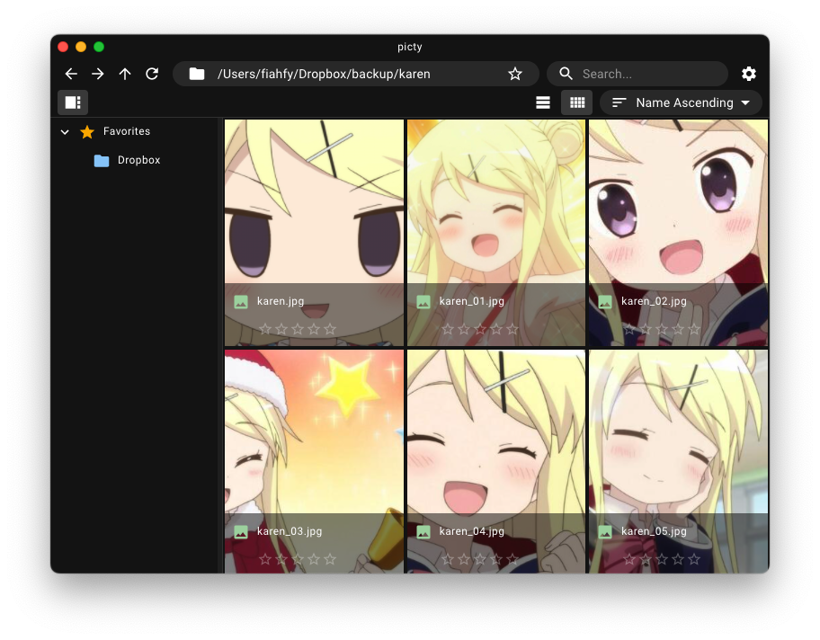
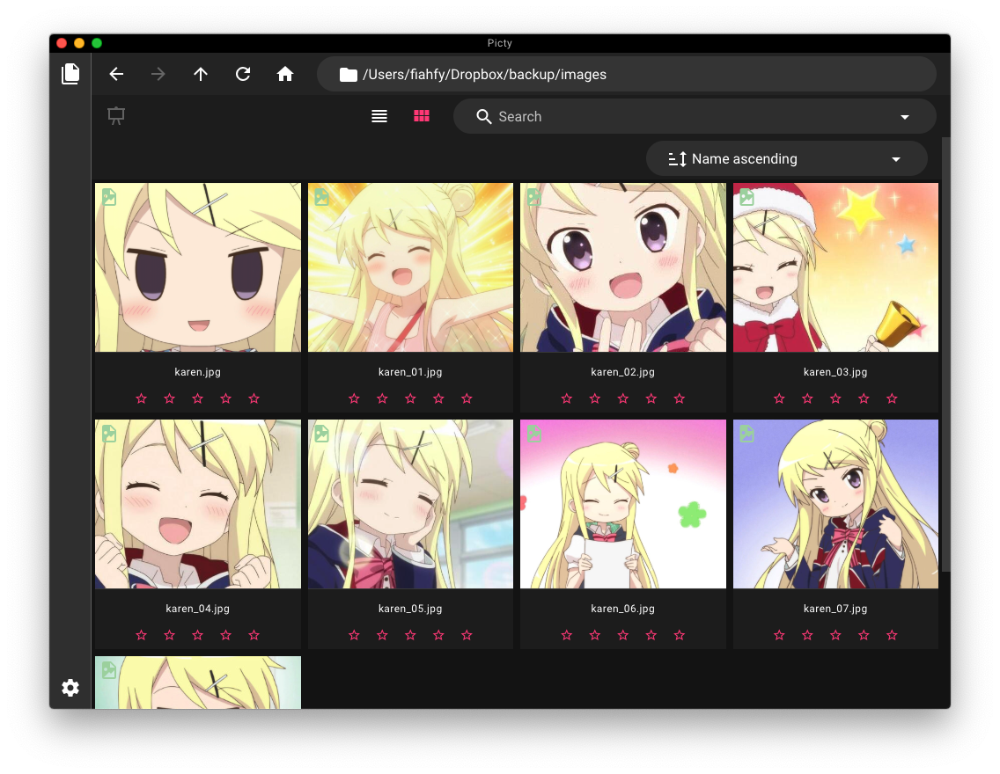

# Picty


> Simple Image Viewer based on Electron.

## Features

- Paging/Zooming controller on viewer
- Rating images
- Bookmark directories
- Change theme (Light/Dark)
- Cross platform support

## Screenshots





## Installation

Download the app from [release page](https://github.com/fiahfy/picty/releases) and install it.  
:warning: For macOS, this app is not signed, so a warning will be displayed at startup.

## Development

```bash
# install dependencies
yarn

# serve with hot reload
yarn dev
```
